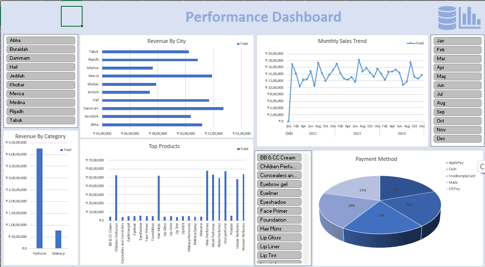

# Excel-Dashboard

## 📊 Project Overview
This project is an interactive **Excel Dashboard** designed to analyze and visualize data using charts, KPIs, and filters.

## 🛠 Tools Used
- Microsoft Excel
- Pivot Tables
- Charts & Slicers

## 📈 Dashboard Preview
Below is a snapshot of the Excel dashboard:



## 🔍 Key Features
- Interactive charts and KPIs
- Pivot-based analysis
- Clean and user-friendly dashboard layout

## 📁 Files in this Repository
```text
dashboard.xlsx   -> Excel Dashboard file
Excel.png        -> Dashboard Screenshot
README.md        -> Project Documentation
